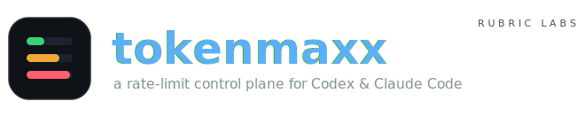
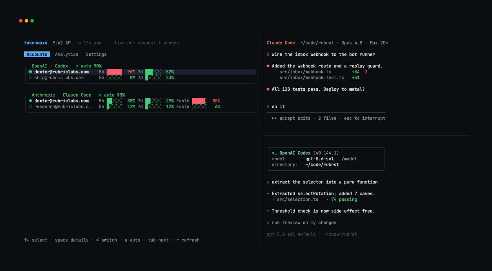
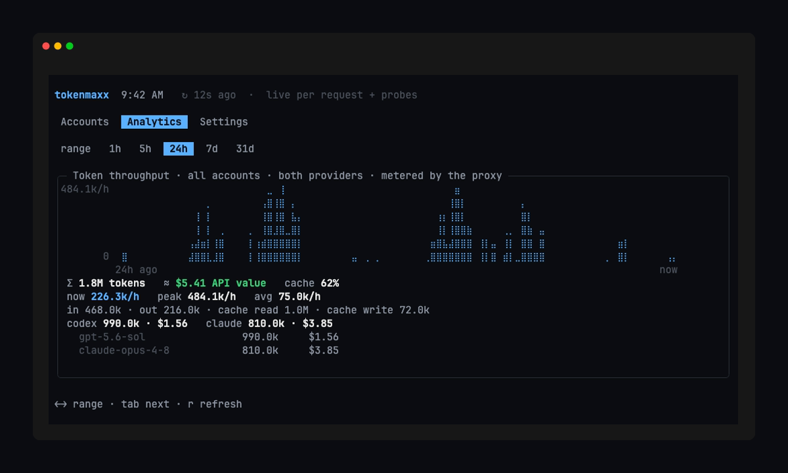
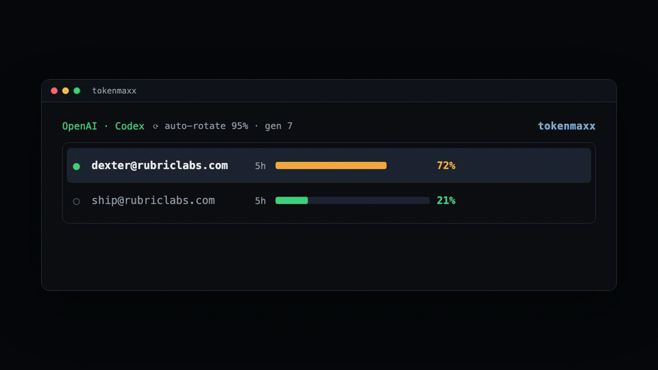

<div align="center">

<picture>
  <source media="(prefers-color-scheme: dark)" srcset="assets/brand/logo-dark.svg">
  <source media="(prefers-color-scheme: light)" srcset="assets/brand/logo-light.svg">
  
</picture>

<br/><br/>

**Juggle rate limits across all your Codex and Claude Code accounts — and see every token you burn.**

<sub>macOS · [Bun](https://bun.sh) · [tokenmaxx.sh](https://tokenmaxx.sh) · a [Rubric Labs](https://rubriclabs.com) project</sub>

<br/>

<picture>
  <source media="(prefers-color-scheme: dark)" srcset="assets/generated/flagship-dark.png">
  <source media="(prefers-color-scheme: light)" srcset="assets/generated/flagship-light.png">
  
</picture>

</div>

## Install

```bash
bun add -g tokenmaxx
```

```bash
tokenmaxx login codex           # sign in (isolated; existing sessions untouched)
tokenmaxx login claude
tokenmaxx install               # route native codex & claude through tokenmaxx

codex                           # use the clients as before — tokenmaxx injects the account
claude
```

## What it does

You have more than one Codex and Claude subscription, and you keep hitting the five-hour or
weekly limit on whichever you're using. tokenmaxx runs a loopback proxy on `127.0.0.1:8459`
that reads the **active account per request** and injects its credential — so switching takes
effect on the very next request, even mid-turn, with the clients running unmodified.
Credentials stay in the macOS Keychain; nothing but opaque references touches disk.

Both providers report live rate-limit state on every response, and the proxy reads it as
traffic streams by — so tokenmaxx always knows exactly how full the active account is, with
zero extra requests. Anything speaking the Anthropic or OpenAI Responses API can point at
`http://127.0.0.1:8459/anthropic` or `/openai` and get the same juggling — the proxy doesn't
care which harness is on the other end.

## Dashboard

Run `tokenmaxx` for a live dashboard. **Accounts** shows every account and its rate-limit
windows, colored by pressure; press space to expand one. **Analytics** is a combined
token-throughput view (tokens/time across every account and both providers) with total
tokens, the **≈ API-list-price value** you're extracting from your flat subscriptions, a
per-model breakdown, and the input / output / cache-read / cache-write split. Tokens are
metered by the proxy as responses stream by — every number is cross-checkable against the
clients' own session logs — and it never buffers or delays them. **Settings** tunes
auto-rotation, the switch threshold, and dwell per provider, applied live.

<div align="center">
<picture>
  <source media="(prefers-color-scheme: dark)" srcset="assets/generated/analytics-dark.png">
  <source media="(prefers-color-scheme: light)" srcset="assets/generated/analytics-light.png">
  
</picture>
</div>

## Auto-rotation

Turn it on and tokenmaxx moves off an account the moment its fullest window crosses your
threshold, onto the one with the most headroom — mid-turn, on the next request. Pressure is
read off every response, so a burst from a fleet of parallel agents can't outrun the switch;
if an account still hits its hard limit mid-flight, the proxy rotates and retries that request
on the next account before your client ever sees the 429. It's off by default; enabling it is
your confirmation that your provider permits this use.

```bash
tokenmaxx auto both on --threshold 90    # or: codex | claude … off
```

<div align="center">
<picture>
  <source media="(prefers-color-scheme: dark)" srcset="assets/generated/switch-dark.gif">
  <source media="(prefers-color-scheme: light)" srcset="assets/generated/switch-light.gif">
  
</picture>
</div>

## Commands

| Command | |
|---|---|
| `tokenmaxx` | Live dashboard |
| `tokenmaxx login <codex\|claude>` | Sign in (idempotent) |
| `tokenmaxx install` · `uninstall` | Route native clients · restore config |
| `tokenmaxx switch <codex\|claude> <email>` | Make an account active |
| `tokenmaxx auto <codex\|claude\|both> <on\|off> [--threshold N]` | Auto-rotation |
| `tokenmaxx list` · `status` · `refresh` · `doctor` | Accounts · JSON · re-probe · checks |

Env: `TOKENMAXX_HOME`, `TOKENMAXX_PROXY_PORT`, `TOKENMAXX_THEME`.

## Not affiliated

tokenmaxx is an independent [Rubric Labs](https://rubriclabs.com) project. It is **not** an
official product of, affiliated with, or endorsed by OpenAI or Anthropic. Use only accounts
you own, and only where the relevant terms permit account automation.

## Credits

Inspired by [`codex-account-switcher`](https://github.com/Sls0n/codex-account-switcher) by
[Sls0n](https://github.com/Sls0n) — thanks for the spark.

<div align="center">
<br/>
<a href="https://rubriclabs.com"></a>
<br/>
<sub>Built by <a href="https://rubriclabs.com">Rubric Labs</a> · <a href="./LICENSE">go nuts</a></sub>
</div>
