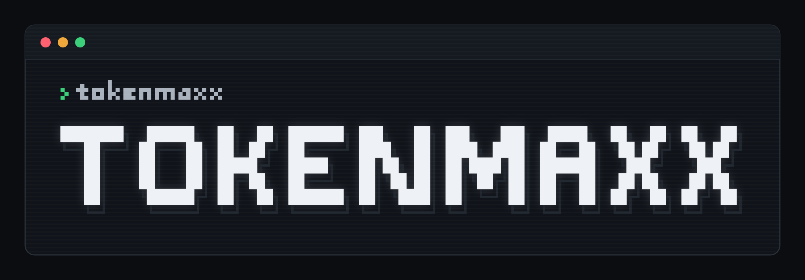
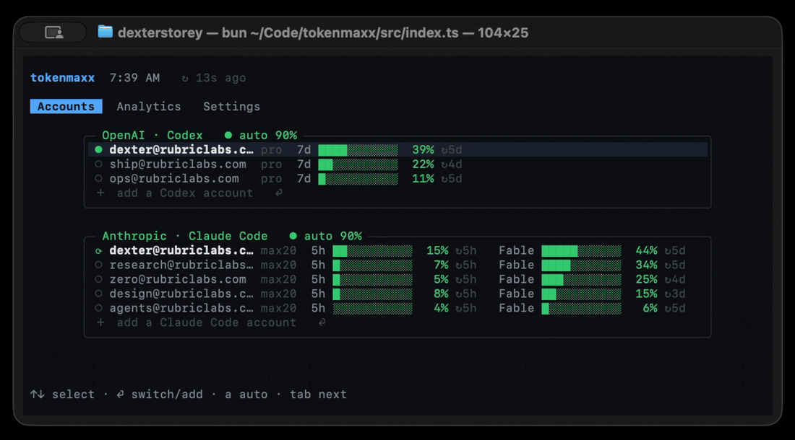
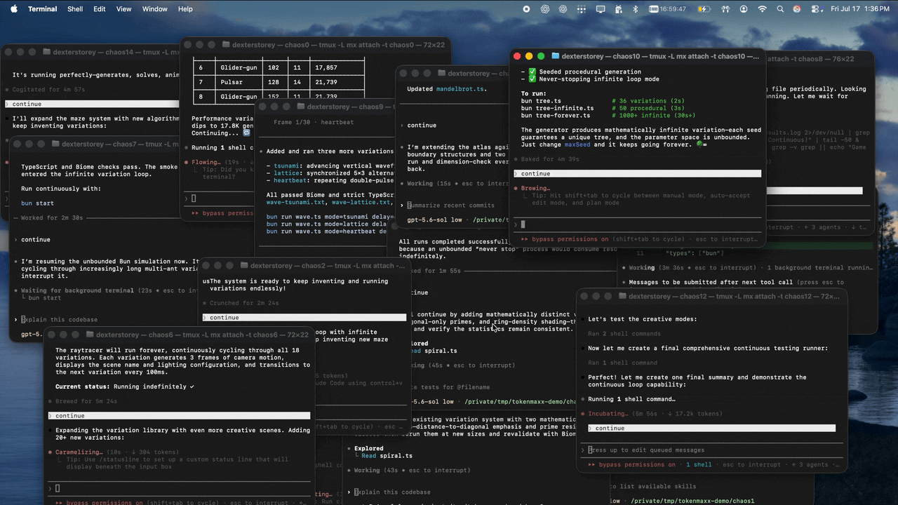
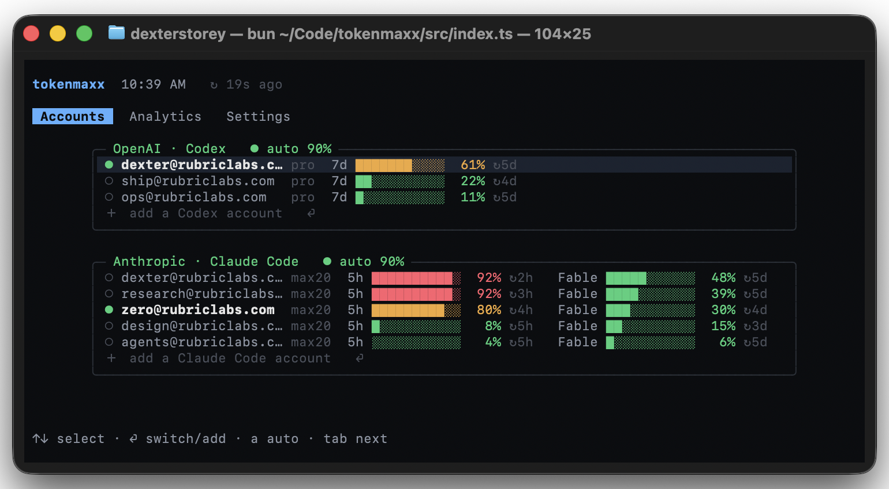
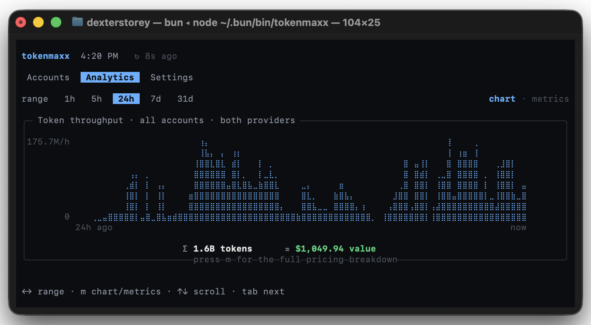
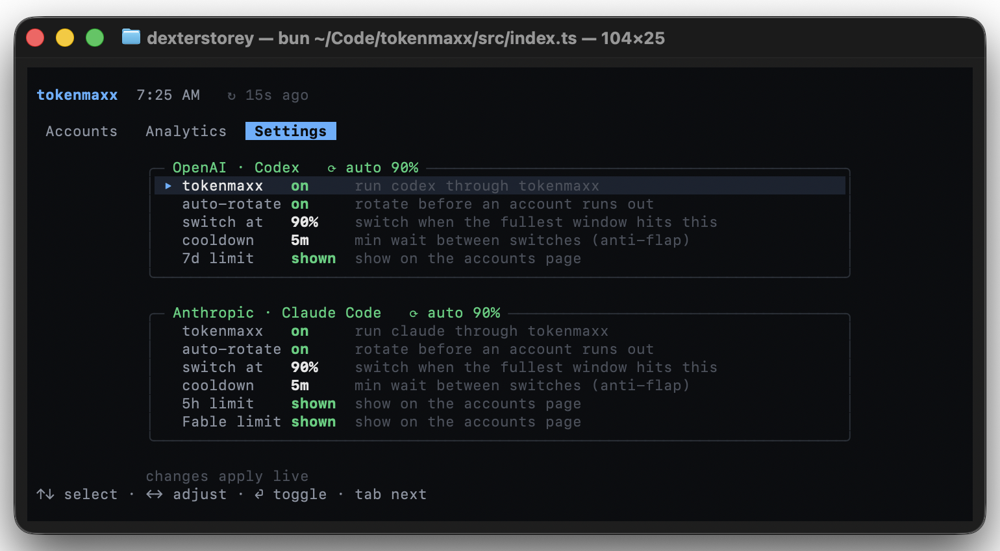

<div align="center">



<br/>

**One dashboard for all of your Codex and Claude Code accounts. Easily switch between them, and monitor usage.**

<sub>macOS · [Bun](https://bun.sh) · a [Rubric Labs](https://rubriclabs.com) project · not affiliated with OpenAI or Anthropic</sub>

<br/><br/>



</div>

## Install

```bash
bun add -g tokenmaxx
```

```bash
tokenmaxx #starts the dashboard
```

## What it does

You run a fleet of coding agents using multiple Codex or Claude accounts:

<div align="center">

</div>

tokenmaxx keeps them all signed in locally and lets you choose which one your clients use. A small proxy on your machine attaches the active account's credential to each request, so a switch takes effect on the very next request, even mid-turn. Your credentials live in the macOS Keychain and never go anywhere except to the provider that issued them.

## The dashboard

Run `tokenmaxx`. **Accounts** shows every account and its live rate-limit windows, colored by pressure, with plan tier and reset countdowns inline. Rows sort by pressure; the ● marks where traffic is going right now.

<div align="center">

</div>

**Analytics** is combined token throughput across all accounts and both providers, with the ≈ cost of that usage at API list rates. Tokens are metered as responses stream by, never buffered, so every number is cross-checkable against your clients' own session logs. Press `m` for the full pricing breakdown per model.

<div align="center">

</div>

**Settings** holds the master on/off per provider, then auto-rotation, the switch threshold, and cooldown, applied live.

<div align="center">

</div>

## Auto-rotation

Turn it on and tokenmaxx watches the active account's rate-limit windows. When the fullest one crosses your threshold, it switches to whichever of your accounts has the most room. The default threshold is 90%, which leaves the last stretch of every window alone in case you want it later. If an account hits a hard limit in the middle of a request, the proxy retries that request on your next account with room.

```bash
tokenmaxx auto both on --threshold 90    # or: codex | claude … off
```

## How it works

A single loopback proxy on `127.0.0.1:8459`, and the clients you already use.

- **Account per request.** The proxy reads which account is active for each request and attaches its credential. Switching lands on the next request.
- **Pressure read for free.** Both providers report rate-limit state on every response; the proxy reads it as traffic streams by, so it always knows how full the active account is, with zero extra requests.
- **Official apps only.** Your subscription login is for Claude Code and Codex. If you're building something custom, use an API key from the provider. tokenmaxx doesn't turn a subscription into an API plan.

## Commands

```text
tokenmaxx                                  live dashboard
tokenmaxx login <codex|claude>             sign in; isolated, idempotent
tokenmaxx install                          route native codex & claude
tokenmaxx uninstall                        restore native config
tokenmaxx switch <codex|claude> <email>    make an account active
tokenmaxx auto <both|codex|claude> <on|off> [--threshold N]
tokenmaxx list | status | refresh | doctor
```

Env: `TOKENMAXX_HOME`, `TOKENMAXX_PROXY_PORT`, `TOKENMAXX_THEME`.

## Intended use

tokenmaxx is for one person with accounts they pay for themselves. No account gets bigger limits, no limit gets bypassed, and your credentials stay between your Keychain and the provider. Don't share accounts, don't pool them, don't resell access. Provider terms change, and it's on you to check that yours allow this kind of switching. The software is provided as is, with no warranty.

## Not affiliated

An independent [Rubric Labs](https://rubriclabs.com) project, not an official
product of, affiliated with, or endorsed by OpenAI or Anthropic. Inspired by
[codex-account-switcher](https://github.com/Sls0n/codex-account-switcher).

<div align="center">
<br/>
<a href="https://rubriclabs.com"></a>
<br/>
<sub>Built by <a href="https://rubriclabs.com">Rubric Labs</a> · <a href="./LICENSE">go nuts</a></sub>
</div>
