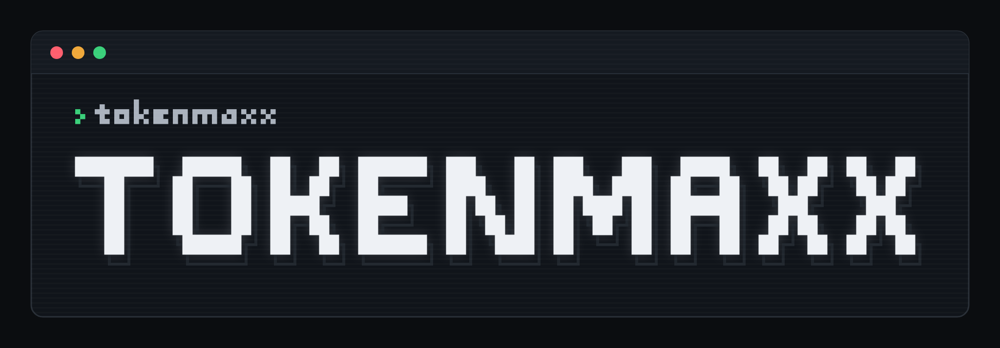
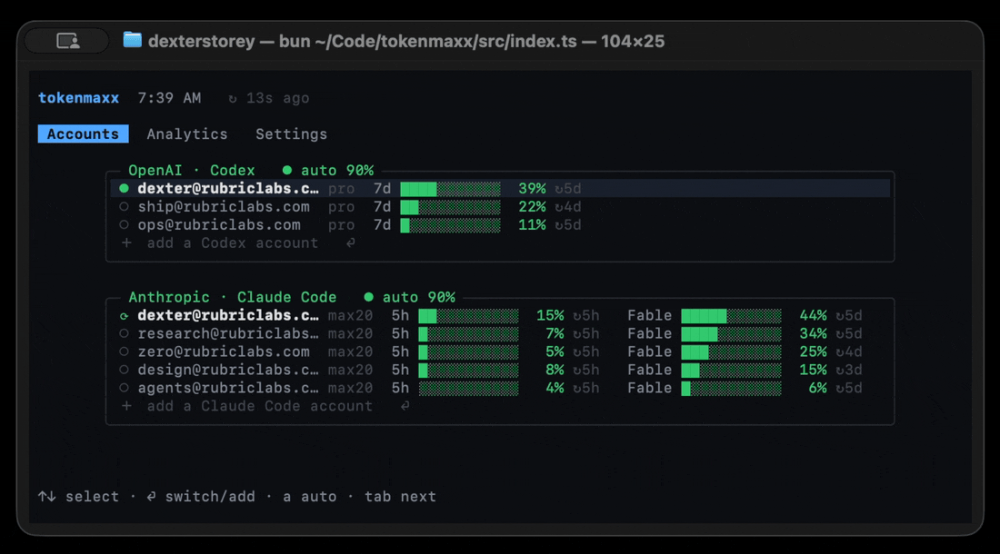
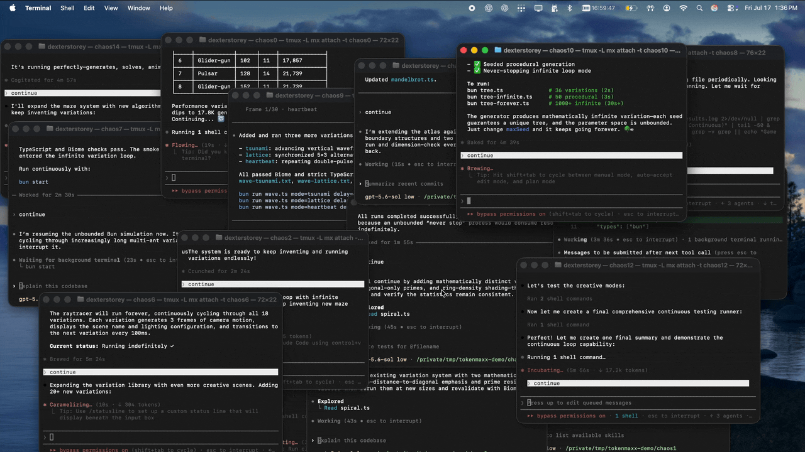
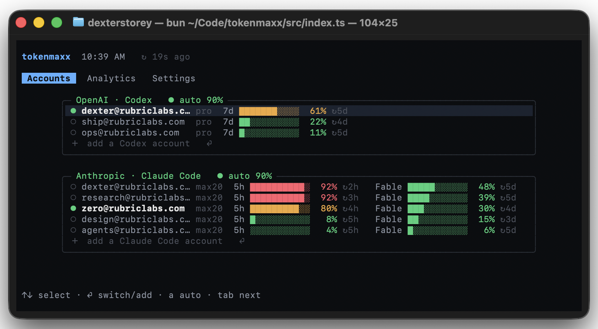
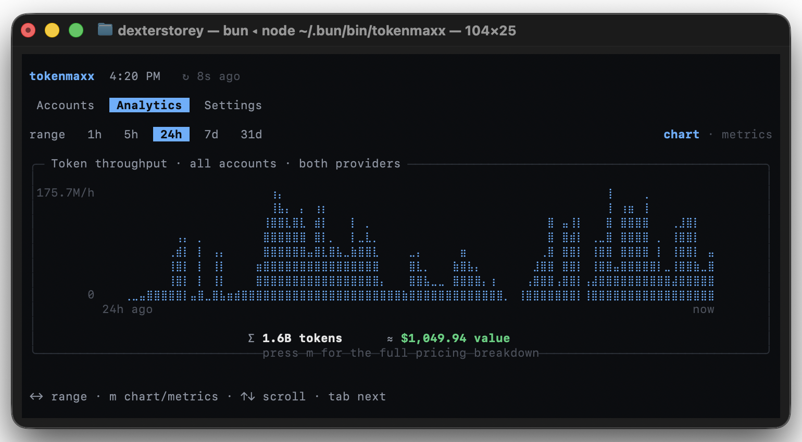
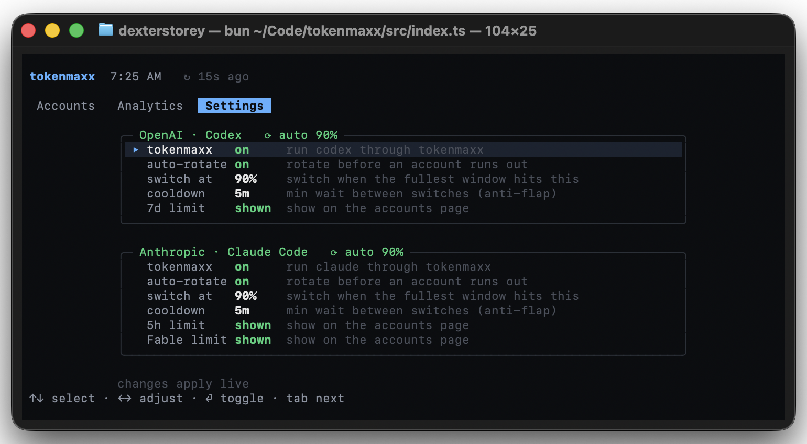

<div align="center">



<br/>

**One dashboard for all of your Codex, Claude Code and Grok accounts. Easily switch between them, and monitor usage.**

<sub>macOS · [Bun](https://bun.sh) · a [Rubric Labs](https://rubriclabs.com) project · not affiliated with OpenAI, Anthropic or xAI</sub>

<br/><br/>



</div>

## Install

```bash
bun add -g tokenmaxx
```

```bash
tokenmaxx #starts the dashboard
```

### Run in the background and start at login

The dashboard connects to a separate background manager. You can close the dashboard or its terminal and keep using your AI clients. To start the manager without opening the dashboard:

```bash
tokenmaxx daemon start
```

To route your clients and have macOS start the manager automatically whenever you log in:

```bash
tokenmaxx install --autostart
```

For pi, use `tokenmaxx install pi --autostart`. If your clients are already configured, add login startup on its own:

```bash
tokenmaxx daemon install
```

Run this as your normal macOS user, without `sudo`. It starts the manager immediately and installs a per-user LaunchAgent that restarts it if it exits. After restarting your Mac, it starts when you log in, when your login Keychain is available. It does not run while the Mac is asleep or shut down.

The background item is named **tokenmaxx** in System Settings → General → Login Items & Extensions. A small launcher app provides that name; launching Bun directly can make macOS display Bun's signing-certificate owner, such as “Jarred Sumner,” instead.

```bash
tokenmaxx daemon status       # manager health and login startup configuration
tokenmaxx daemon stop         # stop now; startup remains installed for the next login
tokenmaxx daemon start        # start again under macOS supervision
tokenmaxx daemon disable      # remove login startup and stop the manager
```

Commands that need the manager, including opening the dashboard, start it again after `daemon stop`. `daemon disable` removes automatic startup while retaining your accounts and data for manual use.

### Uninstall

```bash
tokenmaxx uninstall        # restore native client config; accounts and data stay
tokenmaxx uninstall all    # remove everything, including saved credentials
```

`tokenmaxx uninstall` restores Codex, Claude, Grok, and pi routing and keeps your saved accounts and usage history. `tokenmaxx uninstall pi` restores only pi routing.

`tokenmaxx uninstall all` stops the manager, restores Codex, Claude, Grok, and pi routing, removes the LaunchAgent and launcher app, deletes tokenmaxx's Keychain credentials (including orphaned entries), and removes its account database, usage history, preferences, logs, isolated profiles, and saved setup files. It then asks the owning global package manager—Bun, npm, pnpm, or Yarn—to remove the CLI package. The manager is not restarted.

Setup records the client settings it replaces. Uninstall restores the original files when they are unchanged, removes files and empty client directories created by setup, and preserves unrelated settings and subsequent user edits. Older installations without these records can have their managed routing removed, but previously overwritten settings cannot be recovered. Native client logins, unrelated files, and other packages are preserved. When run from a source checkout, the checkout is kept.

If cleanup fails, the command reports the failed step and keeps the remaining recovery data for a retry. Package removal happens only after setup cleanup succeeds. If the package manager cannot be identified, the command reports that the package still needs removal.

### Startup files and troubleshooting

The installer creates:

- `~/Library/LaunchAgents/sh.tokenmaxx.daemon.plist`
- `~/Applications/tokenmaxx.app` (the background launcher)

Logs remain in `~/.tokenmaxx/runtime/daemon.log`. `tokenmaxx doctor` also reports whether login startup is installed.

Set `TOKENMAXX_HOME`, `TOKENMAXX_PROXY_PORT`, and any custom `CODEX_HOME`, `CLAUDE_CONFIG_DIR`, `GROK_HOME`, or `PI_CODING_AGENT_DIR` before installing startup. These settings and the executable search path are saved for the background service; unrelated environment variables and API keys are not copied. One startup configuration is supported per macOS user. Use the same `TOKENMAXX_HOME` when managing it, and remove the previous startup configuration before installing one for a different directory.

The launcher uses absolute paths to Bun and the installed tokenmaxx entrypoint. Re-run `tokenmaxx daemon install` after moving or reinstalling either tool to refresh those paths. Install from a permanent package location, rather than a temporary `bunx` download or development checkout that you intend to delete.

If startup fails, check `tokenmaxx daemon status`, `tokenmaxx doctor`, and the daemon log. Confirm that the tokenmaxx background item is allowed in System Settings. Running `tokenmaxx daemon install` again refreshes the configuration and retries startup; it may briefly interrupt requests while restarting the manager.

## What it does

You run a fleet of coding agents using multiple Codex, Claude or Grok accounts:

<div align="center">

</div>

tokenmaxx keeps them all signed in locally and lets you choose which one your clients use. A small proxy on your machine attaches the active account's credential to each request, so a switch takes effect on the very next request, even mid-turn. Your credentials live in the macOS Keychain and never go anywhere except to the provider that issued them.

## The dashboard

Run `tokenmaxx`. **Accounts** shows every account and its live rate-limit windows, colored by pressure, with plan tier and reset countdowns inline. Rows sort by pressure; the ● marks where traffic is going right now.

<div align="center">

</div>

**Analytics** is combined token throughput across all accounts and every provider, with the ≈ cost of that usage at API list rates. Tokens are metered as responses stream by, never buffered, so every number is cross-checkable against your clients' own session logs. Press `m` for the full pricing breakdown per model.

<div align="center">

</div>

**Settings** holds the master on/off per provider, then auto-rotation, the switch threshold, and cooldown, applied live.

<div align="center">

</div>

## The app

`gui/` is a native macOS app built with [GPUI](https://gpui.rs) and [GPUI Kit](https://gpui-kit.com). It covers everything the dashboard does: accounts, switching, sign-in, reset credits, analytics, and every setting. It can also live in the menu bar, where each provider's accounts and their rate-limit windows are one click away.

The app ships its own compiled `tokenmaxx` and drives the same daemon and `~/.tokenmaxx` state as the command line, so both always agree. Settings → System → Command-line tool links that binary onto your PATH. Settings → App picks the appearance (auto, light, dark), whether tokenmaxx shows in the menu bar, the Dock, or both, and which terminal runs subscription sign-in.

```bash
bun run gui:dev       # run against a dev build of the CLI
bun run gui:bundle    # gui/target/tokenmaxx.app
```

Building needs Rust (stable) and Xcode's command-line tools.

## Auto-rotation

Turn it on and tokenmaxx watches the active account's rate-limit windows. When the fullest one crosses your threshold, it switches to whichever of your accounts has the most room. The default threshold is 90%, which leaves the last stretch of every window alone in case you want it later. If an account hits a hard limit in the middle of a request, the proxy retries that request on your next account with room.

```bash
tokenmaxx auto all on --threshold 90     # or: codex | claude | grok … off
```

Want some accounts used before others? Put them in order. Auto-rotation then switches to the first account in your order that still has room, instead of the emptiest one, and moves back to an earlier account once its window resets, after the cooldown. Accounts you leave out go after the ones you list. In the dashboard, `[` and `]` move the selected account.

```bash
tokenmaxx order claude work@acme.com personal@me.com    # --reset goes back to "most room"
```

## How it works

A single loopback proxy on `127.0.0.1:8459`, and the clients you already use.

- **Account per request.** The proxy reads which account is active for each request and attaches its credential. Switching lands on the next request.
- **Pressure read for free.** Codex and Claude report rate-limit state on every response; the proxy reads it as traffic streams by, so it always knows how full the active account is, with zero extra requests. Grok reports nothing until it says no, so a Grok account's meter is empty until a 429 fills it, and auto-rotation for Grok is driven by hard limits rather than a threshold.
- **Official apps only.** Your subscription login is for Claude Code, Codex and the grok CLI. If you're building something custom, use an API key from the provider. tokenmaxx doesn't turn a subscription into an API plan.

## Commands

```text
tokenmaxx                                  live dashboard
tokenmaxx login <codex|claude|grok>        sign in; isolated, idempotent
tokenmaxx install [pi] [--autostart]       route native codex, claude & grok; optionally start at login
tokenmaxx uninstall [pi]                   restore native config; accounts and data stay
tokenmaxx uninstall all                    remove all setup, data, credentials, and the global package
tokenmaxx daemon start | stop | status     manage the background manager
tokenmaxx daemon install | disable         add or remove macOS login startup
tokenmaxx switch <codex|claude|grok> <email>   make an account active
tokenmaxx logout [codex|claude|grok] <email>   sign out; the credential is deleted
tokenmaxx order <codex|claude|grok> [email…]   which accounts auto-rotation uses first
tokenmaxx auto <all|codex|claude|grok> <on|off> [--threshold N]
tokenmaxx list | status | refresh | doctor
```

Env: `TOKENMAXX_HOME`, `TOKENMAXX_PROXY_PORT`, `TOKENMAXX_THEME`.

The dashboard asks your terminal for its colors (OSC 4/10/11) and uses them, so it matches the theme you already run. Terminals that don't answer get a built-in dark or light palette instead. Settings → Display switches between `auto`, `dark` and `light` and stores the choice in `~/.tokenmaxx/preferences.json`. `TOKENMAXX_THEME` pins any of the three for one run and beats the stored choice.

## Intended use

tokenmaxx is for one person with accounts they pay for themselves. No account gets bigger limits, no limit gets bypassed, and your credentials stay between your Keychain and the provider. Don't share accounts, don't pool them, don't resell access. Provider terms change, and it's on you to check that yours allow this kind of switching. The software is provided as is, with no warranty.

## Not affiliated

An independent [Rubric Labs](https://rubriclabs.com) project, not an official
product of, affiliated with, or endorsed by OpenAI, Anthropic or xAI. Inspired by
[codex-account-switcher](https://github.com/Sls0n/codex-account-switcher).

<div align="center">
<br/>
<a href="https://rubriclabs.com"></a>
<br/>
<sub>Built by <a href="https://rubriclabs.com">Rubric Labs</a> · <a href="./LICENSE">go nuts</a></sub>
</div>
